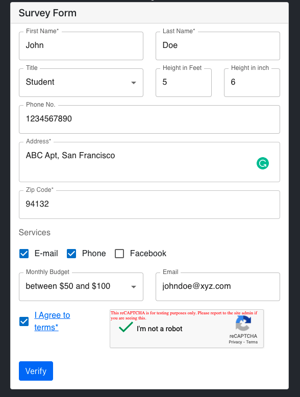
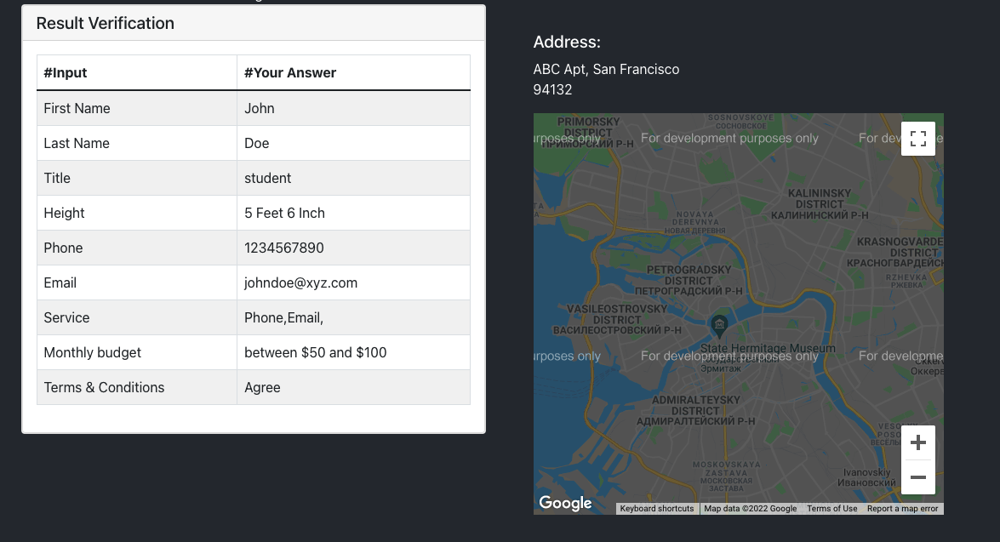

# Data Survey Form

## Deployed on GH-Pages and Heroku
https://developer-soni.github.io/Data-Survey-Form/ \
https://www.datasurveyform.herokuapp.com

## Description
* For the development I used React.js.
* For field validation I used MaterialUI Text Field; yup package used for validation.
* For maps I used React Google Map API Package.
* For captcha I used React Captcha.
* Responsive for Web and Mobile.

## Documentation and Code
URL : https://github.com/developer-soni/Data-Survey-Form

## Run and test the survey form
In the project directory, you can run:
### `npm install`
### `npm start`

This project was bootstrapped with [Create React App](https://github.com/facebook/create-react-app).\
Runs the app in the development mode.\
Open [http://localhost:3000](http://localhost:3000) to view it in the browser.

The page will reload if you make edits.\
You will also see any lint errors in the console.

### After filling the survey and clicking on VERIFY button, a Form Validation Page will load to verify the details entered by the user. 

## Screenshots

